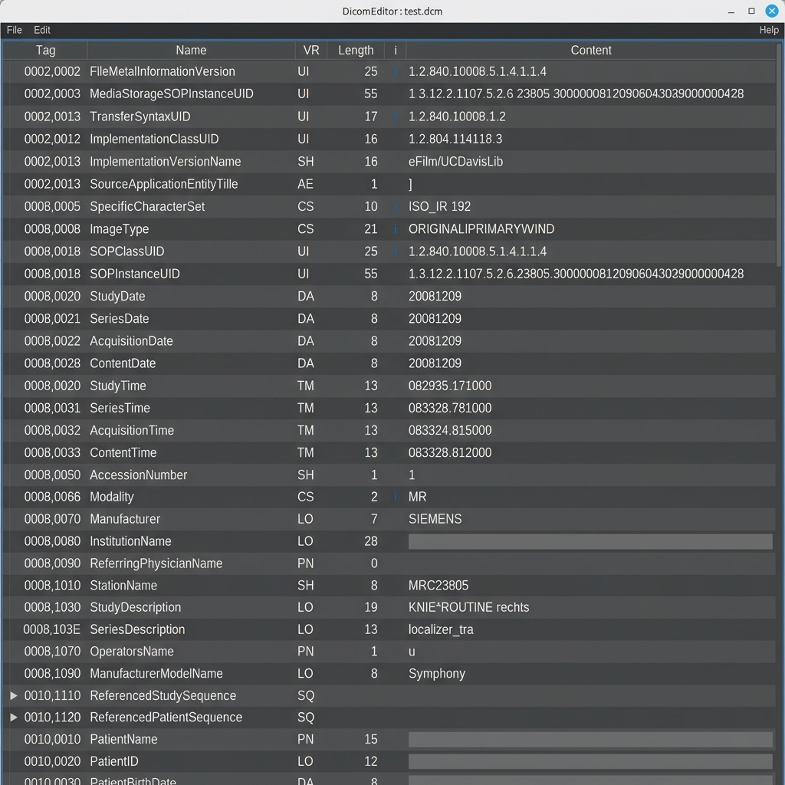
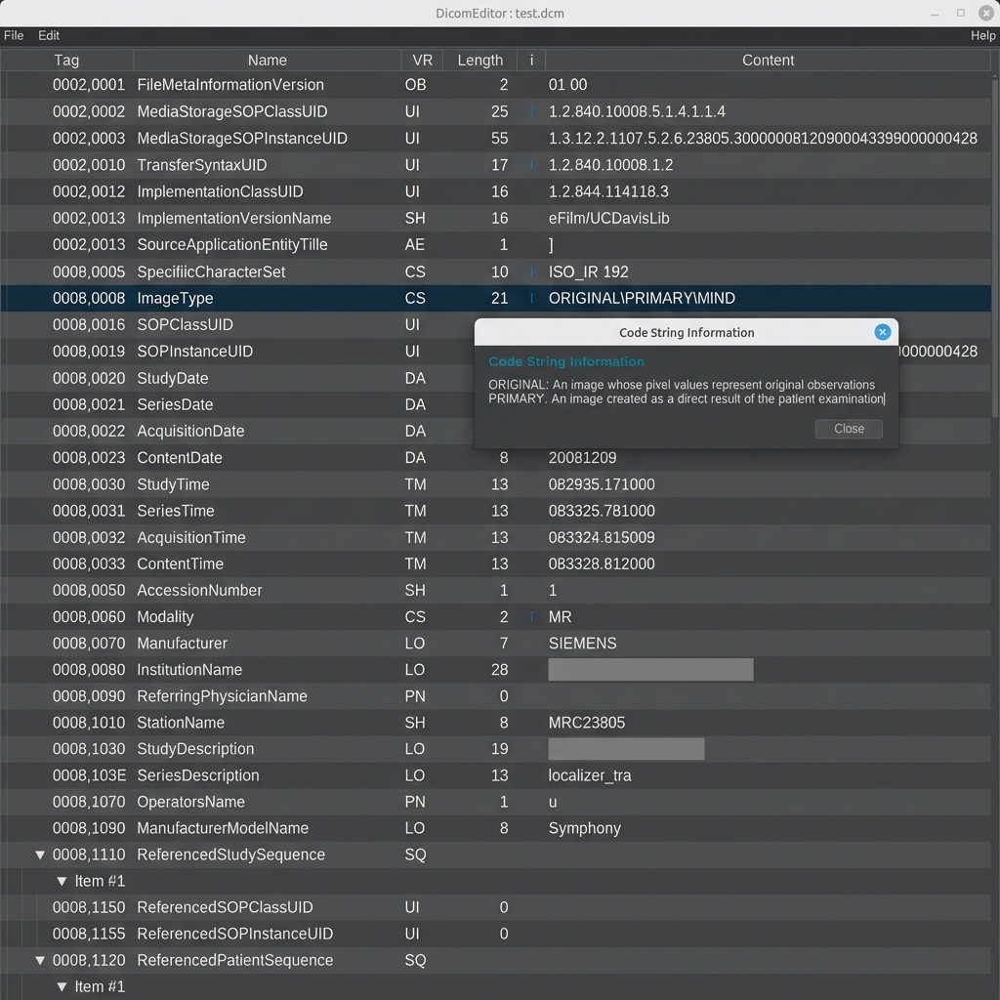

# DicomEditor

A Java-based desktop application for viewing and editing DICOM metadata using the [dcm4che](https://github.com/dcm4che/dcm4che) library.


<p align="center">
  
</p>
<p align="center">
  
</p>

## Features

- **Metadata Inspection**: View all DICOM tags in a structured table.
- **Tag Editing**: Easily modify, add, or delete DICOM attributes.
- **Intelligent Insights**:
  - Detailed Tag Information based on DICOM PS3.6.
  - Interactive VR (Value Representation) explanations.
  - Automated CodeString (CS) value decoding.
  - UID status verification and identification.
- **Enhanced Validation**: Real-time validation including Value Multiplicity (VM) compliance.
- **Drag & Drop**: Simply drop DICOM files into the application to open them.
- **Character Set Support**: Manage and set Specific Character Sets (e.g., ISO_IR 100, UTF-8).
- **Modern UI**: Clean and dark interface powered by FlatLaf (Darcula).
- **Multi-Frame Support**: Open several files in independent windows.

## Getting Started

### Prerequisites

- **Java Runtime Environment (JRE) 21** or higher.

### Installation

Currently, the application can be built from source or run as a standalone JAR.

1. Download the latest release (if available).
2. Run the executable:
   ```bash
   java -jar dicomeditor-0.1.0-shaded.jar
   ```

## User Guide

- **Opening Files**: Use `File > Open` or drag a DICOM file onto the main window.
- **Editing Tags**: Right-click on the table to "Add Tag..." or "Delete Tag".
- **Saving**: Select `File > Save` to overwrite the current file or `File > Save As...` to create a new one.

---

## Development

### Tech Stack

- **Language**: Java 21
- **Build System**: Maven
- **DICOM Library**: dcm4che 5.34.2
- **Logging**: Log4j 2
- **UI Framework**: Swing with FlatLaf

### Prerequisites

- **Java Development Kit (JDK) 21**
- **Maven 3.8+**

### Building from Source

To compile the project and generate the shaded JAR:

```bash
mvn clean package
```

The resulting JAR will be located in the `target/` directory:
- `dicomeditor-0.1.0.jar` (Standard JAR)
- `dicomeditor-0.1.0-shaded.jar` (Fat JAR with all dependencies)

### Running in Development

You can run the application directly using Maven:

```bash
mvn exec:java -Dexec.mainClass="de.in.dicom.tools.DicomEditor"
```

### Windows Executable (Optional)

The project includes a `launch4j` profile to generate a Windows `.exe`:

```bash
mvn clean package -Plaunch4j
```

---

## Author & Credits

- Developed by **TiJaWo68** in cooperation with **Gemini 3 Flash using Antigravity**.
- Powered by the [dcm4che](https://www.dcm4che.org/) project.

## License

*Specify license here (e.g., MIT, Apache 2.0)*
